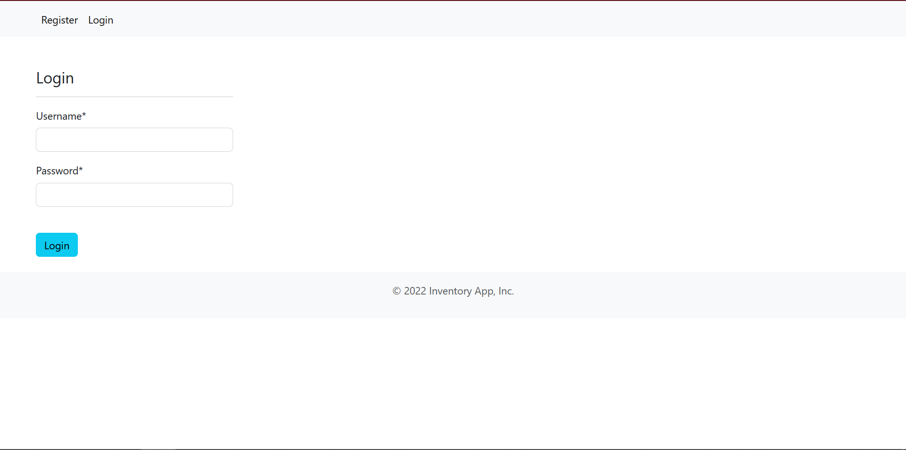
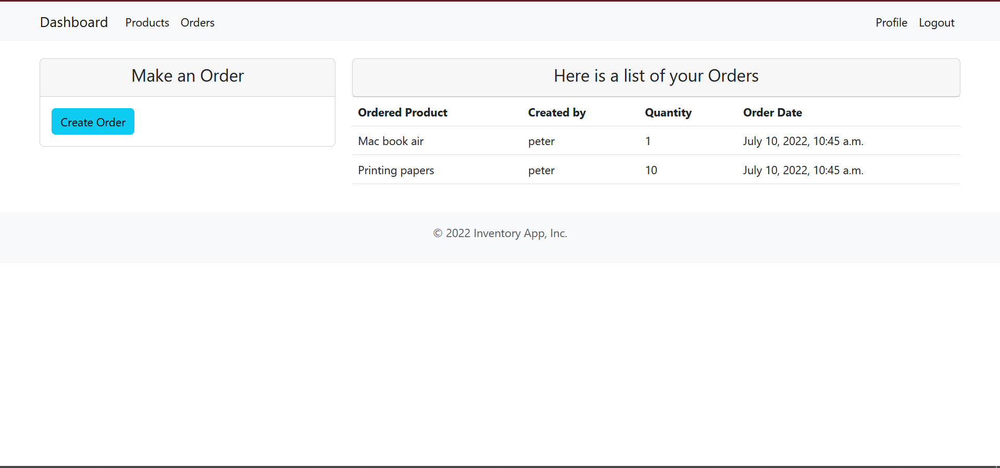
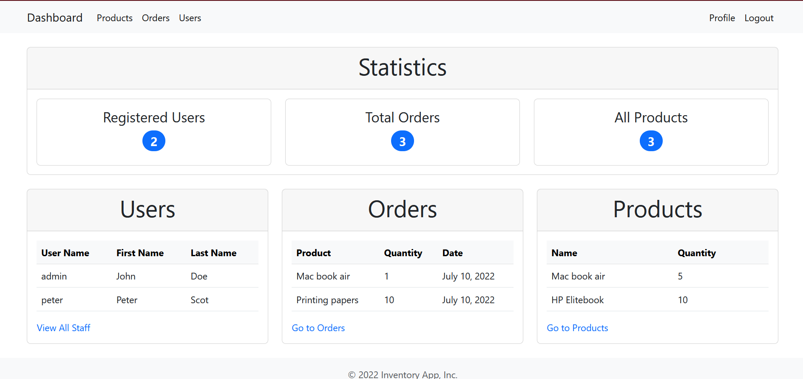

# Inventory
This is an inventory management system which helps businesses track and issue out products.
The system extends the django authentication system to separate the roles of each user in the system.

## Installation instructions
Create a virtual 

```python3 -m venv env```

Activate the virtual env

```source env/bin/activate```

Install the required packages

```pip install -r requirements.txt```

Start the server

```python manage.py runserver```

## Screenshots


Login Screen



User view



Admin user view